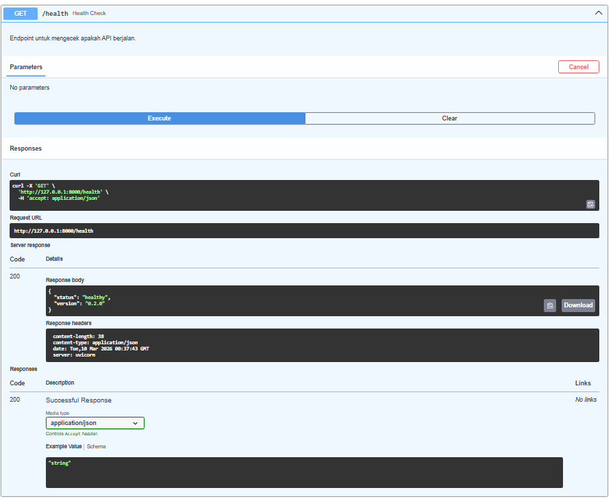
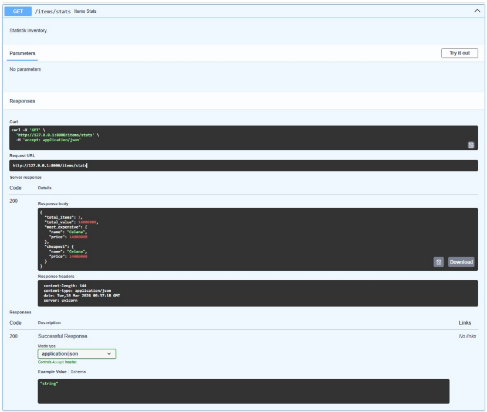
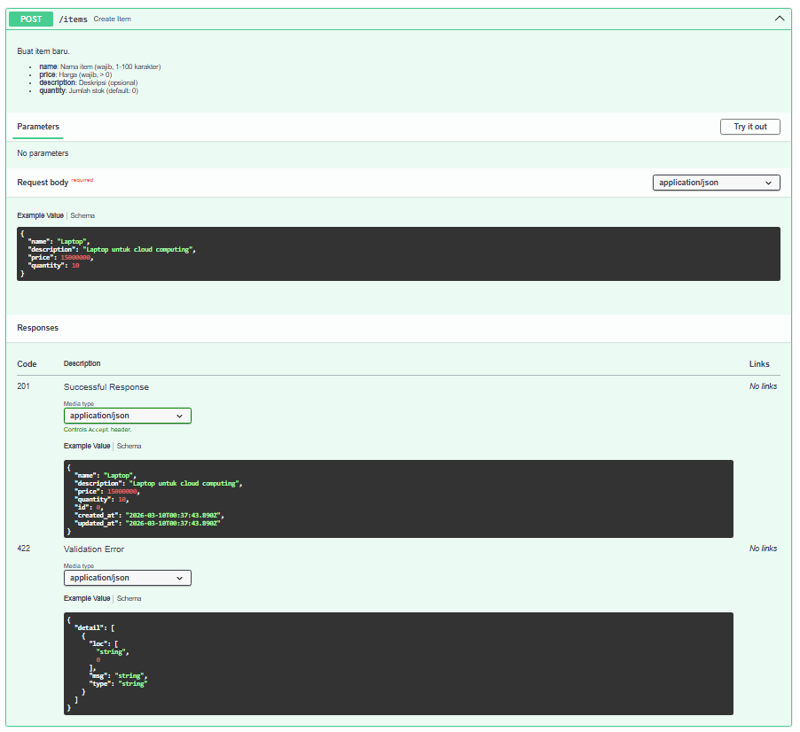
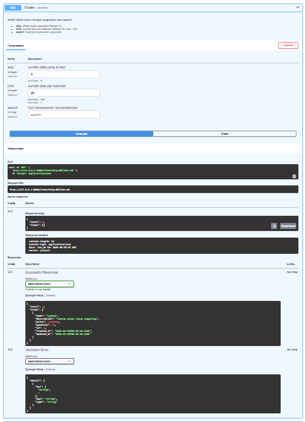
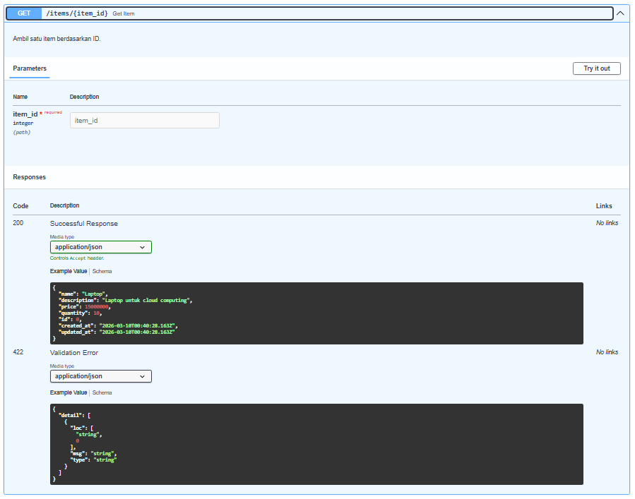
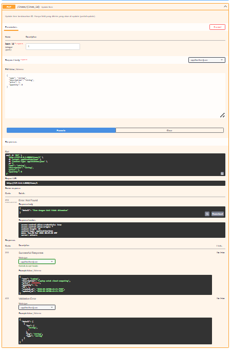
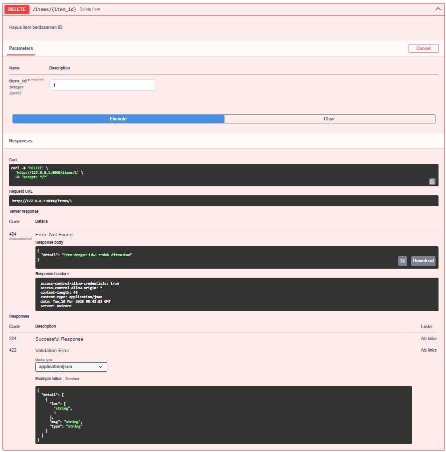
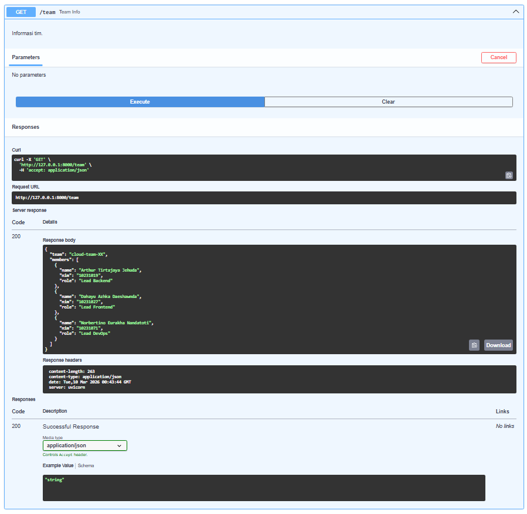

# Dokumentasi Hasil Testing API

**Cloud App API v0.2.0**  
**Tanggal Testing:** 10/03/2026  
**Tester:** Team Agile  
**Tool yang Digunakan:** Swagger UI  
**Base URL:** `http://127.0.0.1:8000`

---

## Ringkasan Testing

| No  | Endpoint       | Method | Status  | Keterangan                   |
| --- | -------------- | ------ | ------- | ---------------------------- |
| 1   | `/health`      | GET    | ✅ Pass | Health check berhasil        |
| 2   | `/items/stats` | GET    | ✅ Pass | Statistik inventory berhasil |
| 3   | `/items`       | POST   | ✅ Pass | Create item berhasil         |
| 4   | `/items`       | GET    | ✅ Pass | List items dengan pagination |
| 5   | `/items/{id}`  | GET    | ✅ Pass | Get single item              |
| 6   | `/items/{id}`  | PUT    | ✅ Pass | Update item berhasil         |
| 7   | `/items/{id}`  | DELETE | ✅ Pass | Delete item berhasil         |
| 8   | `/team`        | GET    | ✅ Pass | Team info berhasil           |

---

## Detail Testing per Endpoint

### 1. Health Check

**Endpoint:** `GET /health`  
**Deskripsi:** Endpoint untuk mengecek apakah API berjalan.

**cURL:**

```bash
curl -X 'GET' \
  'http://127.0.0.1:8000/health' \
  -H 'accept: application/json'
```

**Request URL:**

```
http://127.0.0.1:8000/health
```

**Response:** `200 OK`

```json
{
  "status": "healthy",
  "version": "0.2.0"
}
```

**Response Headers:**

```
content-length: 38
content-type: application/json
date: Tue, 10 Mar 2026 00:37:43 GMT
server: uvicorn
```

**Screenshot:**


---

### 2. Items Statistics

**Endpoint:** `GET /items/stats`  
**Deskripsi:** Statistik inventory.

**cURL:**

```bash
curl -X 'GET' \
  'http://127.0.0.1:8000/items/stats' \
  -H 'accept: application/json'
```

**Request URL:**

```
http://127.0.0.1:8000/items/stats
```

**Response:** `200 OK`

```json
{
  "total_items": 1,
  "total_value": 14000000,
  "most_expensive": {
    "name": "Celana",
    "price": 14000000
  },
  "cheapest": {
    "name": "Celana",
    "price": 14000000
  }
}
```

**Response Headers:**

```
content-length: 144
content-type: application/json
date: Tue, 10 Mar 2026 00:37:18 GMT
server: uvicorn
```

**Screenshot:**


---

### 3. Create Item

**Endpoint:** `POST /items`  
**Deskripsi:** Buat item baru.

- **name**: Nama item (wajib, 1-100 karakter)
- **price**: Harga (wajib, > 0)
- **description**: Deskripsi (opsional)
- **quantity**: Jumlah stok (default: 0)

**cURL:**

```bash
curl -X 'POST' \
  'http://127.0.0.1:8000/items' \
  -H 'accept: application/json' \
  -H 'Content-Type: application/json' \
  -d '{
  "name": "Laptop",
  "description": "Laptop untuk cloud computing",
  "price": 15000000,
  "quantity": 10
}'
```

**Request URL:**

```
http://127.0.0.1:8000/items
```

**Request Body:**

```json
{
  "name": "Laptop",
  "description": "Laptop untuk cloud computing",
  "price": 15000000,
  "quantity": 10
}
```

**Response:** `201 Created`

```json
{
  "name": "Laptop",
  "description": "Laptop untuk cloud computing",
  "price": 15000000,
  "quantity": 10,
  "id": 0,
  "created_at": "2026-03-10T00:46:43.488Z",
  "updated_at": "2026-03-10T00:46:43.488Z"
}
```

**Screenshot:**


---

### 4. List Items (dengan Pagination)

**Endpoint:** `GET /items`  
**Deskripsi:** Ambil daftar items dengan pagination dan search.

- **skip**: Offset untuk pagination (default: 0)
- **limit**: Jumlah item per halaman (default: 20, max: 100)
- **search**: Kata kunci pencarian (opsional)

**cURL:**

```bash
curl -X 'GET' \
  'http://127.0.0.1:8000/items?skip=0&limit=20' \
  -H 'accept: application/json'
```

**Request URL:**

```
http://127.0.0.1:8000/items?skip=0&limit=20
```

**Response:** `200 OK`

```json
{
  "total": 0,
  "items": []
}
```

**Response Headers:**

```
content-length: 22
content-type: application/json
date: Tue, 10 Mar 2026 00:39:25 GMT
server: uvicorn
```

**Screenshot:**


---

### 5. Get Single Item

**Endpoint:** `GET /items/{item_id}`  
**Deskripsi:** Ambil satu item berdasarkan ID.

**cURL:**

```bash
curl -X 'GET' \
  'http://127.0.0.1:8000/items/1' \
  -H 'accept: application/json'
```

**Request URL:**

```
http://127.0.0.1:8000/items/1
```

**Response:** `200 OK`

```json
{
  "name": "Laptop",
  "description": "Laptop untuk cloud computing",
  "price": 15000000,
  "quantity": 10,
  "id": 0,
  "created_at": "2026-03-10T00:46:43.500Z",
  "updated_at": "2026-03-10T00:46:43.500Z"
}
```

**Screenshot:**


#### Test Case: Item Not Found

**Request URL:**

```
http://127.0.0.1:8000/items/999
```

**Response:** `404 Not Found`

```json
{
  "detail": "Item dengan id=999 tidak ditemukan"
}
```

---

### 6. Update Item

**Endpoint:** `PUT /items/{item_id}`  
**Deskripsi:** Update item berdasarkan ID. Hanya field yang dikirim yang akan di-update (partial update).

**cURL:**

```bash
curl -X 'PUT' \
  'http://127.0.0.1:8000/items/1' \
  -H 'accept: application/json' \
  -H 'Content-Type: application/json' \
  -d '{
  "name": "string",
  "description": "string",
  "price": 1,
  "quantity": 0
}'
```

**Request URL:**

```
http://127.0.0.1:8000/items/1
```

**Request Body:**

```json
{
  "name": "string",
  "description": "string",
  "price": 1,
  "quantity": 0
}
```

**Response:** `200 OK`

```json
{
  "name": "Laptop",
  "description": "Laptop untuk cloud computing",
  "price": 15000000,
  "quantity": 10,
  "id": 0,
  "created_at": "2026-03-10T00:46:43.508Z",
  "updated_at": "2026-03-10T00:46:43.508Z"
}
```

**Screenshot:**


---

### 7. Delete Item

**Endpoint:** `DELETE /items/{item_id}`  
**Deskripsi:** Hapus item berdasarkan ID.

**cURL:**

```bash
curl -X 'DELETE' \
  'http://127.0.0.1:8000/items/1' \
  -H 'accept: */*'
```

**Request URL:**

```
http://127.0.0.1:8000/items/1
```

**Response:** `204 No Content` (jika berhasil)

#### Test Case: Item Not Found

**Response:** `404 Not Found`

```json
{
  "detail": "Item dengan id=1 tidak ditemukan"
}
```

**Response Headers:**

```
access-control-allow-credentials: true
access-control-allow-origin: *
content-length: 45
content-type: application/json
date: Tue, 10 Mar 2026 00:42:53 GMT
server: uvicorn
```

**Screenshot:**


---

### 8. Team Info

**Endpoint:** `GET /team`  
**Deskripsi:** Informasi tim.

**cURL:**

```bash
curl -X 'GET' \
  'http://127.0.0.1:8000/team' \
  -H 'accept: application/json'
```

**Request URL:**

```
http://127.0.0.1:8000/team
```

**Response:** `200 OK`

```json
{
  "team": "cloud-team-XX",
  "members": [
    {
      "name": "Arthur Tirtajaya Jehuda",
      "nim": "10231019",
      "role": "Lead Backend"
    },
    {
      "name": "Dahayu Azhka Daeshawnda",
      "nim": "10231027",
      "role": "Lead Frontend"
    },
    {
      "name": "Norbertino Eurakha Nandatoti",
      "nim": "10231071",
      "role": "Lead DevOps"
    }
  ]
}
```

**Response Headers:**

```
content-length: 263
content-type: application/json
date: Tue, 10 Mar 2026 00:43:44 GMT
server: uvicorn
```

**Screenshot:**


---

## Struktur Folder Screenshots

```
docs/
├── api-test-results.md
└── screenshots/
    ├── health.png        # GET /health
    ├── itemstats.png     # GET /items/stats
    ├── createitem.png    # POST /items
    ├── listitem.png      # GET /items
    ├── getitem.png       # GET /items/{id}
    ├── updateitem.png    # PUT /items/{id}
    ├── deleteitem.png    # DELETE /items/{id}
    └── teaminfo.png      # GET /team
```

---

## Catatan Testing

- [x] Semua endpoint berfungsi dengan baik
- [x] Response sesuai dengan schema yang didefinisikan
- [x] Error handling berjalan dengan benar (404, 422, dll)
- [x] CORS berfungsi untuk akses dari frontend

---

## Kesimpulan

> Semua endpoint API telah diuji dan berfungsi sesuai spesifikasi. API siap untuk diintegrasikan dengan frontend.

**Status Keseluruhan:** ✅ **PASSED**
